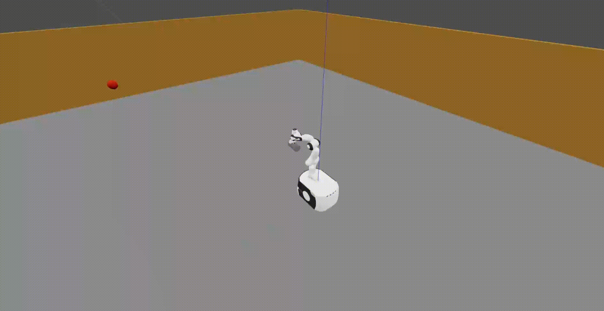

#  CushionCatch: A Compliant Catching Mechanism for Mobile Manipulators via Combined Optimization and Learning 

The paper has been accepted for the 2025 IROS.

Project Page: https://cushion-catch.github.io/

arXiv: https://arxiv.org/pdf/2409.14754

<!-- Simulation Results -->
<h2>Simulation Results</h2>
<table>
  <tr>
    <td></td>
    <td></td>
    <td></td>
    <td></td>
  </tr>
</table>

<!-- Real-World Experiments -->
<h2>Real-World Results</h2>
<table>
  <tr>
    <td></td>
    <td></td>
    <td></td>
    <td></td>
  </tr>
</table>

<!-- Collision Case Study -->
<h2>Collision Case Study</h2>
<table style="width:100%; table-layout:fixed;">
  <tr>
    <td style="width:33.33%; text-align:center; vertical-align:top;">
      
      <div><strong>No Collision</strong><br/><small>all constraints enforced</small></div>
    </td>
    <td style="width:33.33%; text-align:center; vertical-align:top;">
      
      <div><strong>Self-Collision</strong><br/><small>self-collision constraint not enforced</small></div>
    </td>
    <td style="width:33.33%; text-align:center; vertical-align:top;">
      
      <div><strong>Ground Collision</strong><br/><small>ground-collision constraint not enforced</small></div>
    </td>
  </tr>
</table>


# Installation

1. Create environment 

   ```bash
   conda create -n cushion_catch python=3.9
   conda activate cushion_catch
   ```

2. Install swift by https://github.com/jhavl/swift.git

   ```bash
   cd swift
   pip install -e .
   ```

3. Clone this codebase

   ```bash
   cd CushionCatch
   pip install -r requirements.txt
   ```

# Running
Default (with safety constraints enabled)
  ```bash
  python robot_catch.py
  ```
Disable self-collision constraint only
  ```bash
  python robot_catch.py --no-self-collision-cons
  ```
Disable ground-collision constraint only
  ```bash
  python robot_catch.py --no-ground-collision-cons
  ```

# Code Structure
```
|-- Cushion-Catch
    |-- Compliance_Learner  # PE-LSTM network for learning compliant trajectories from human demonstrations
    |-- Env                 # Robot and simulation environment definitions
    |-- Plot                # Scripts for plotting catching results
    |-- POC                 # Code for the POC planner
    |-- PRC                 # Code for the PRC planner
    |-- gifs                # gifs for readme
```
